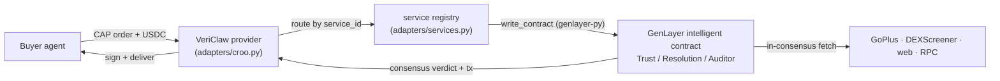
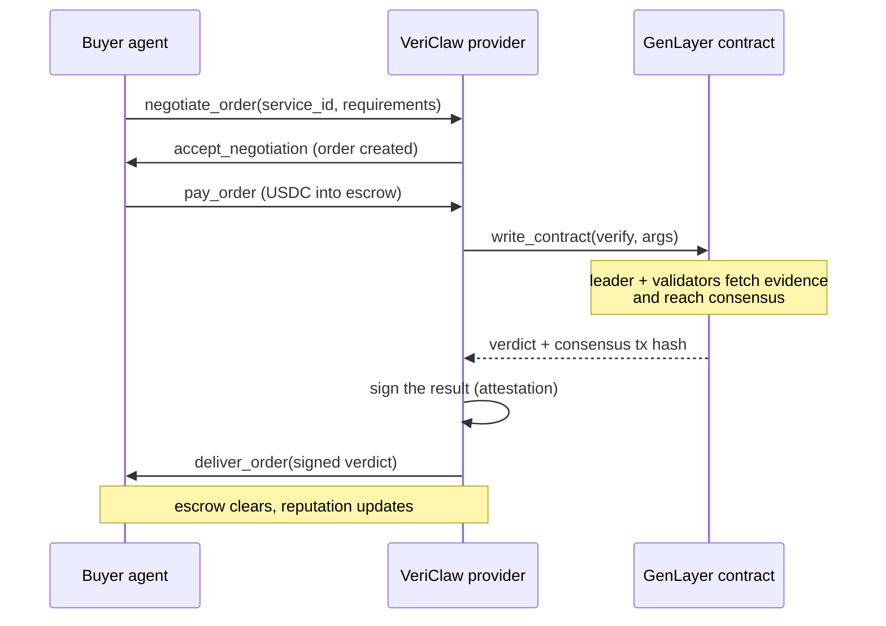
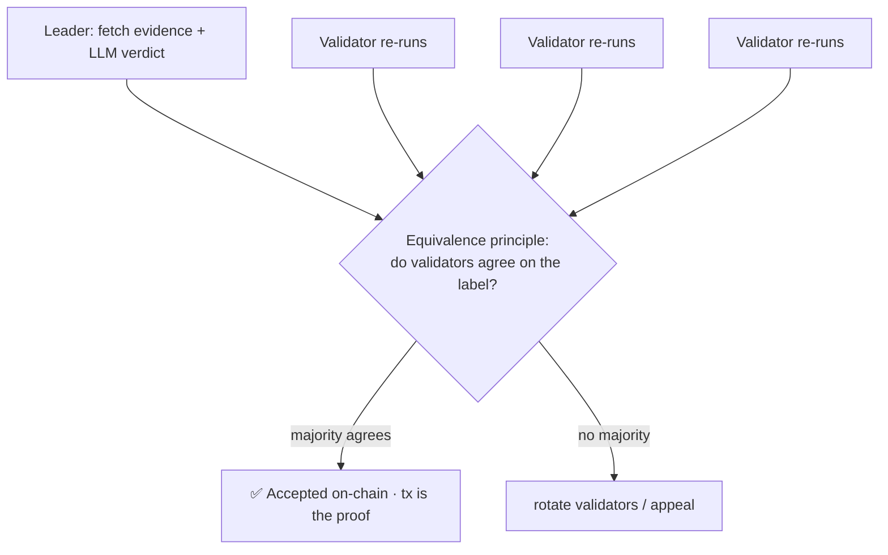

<div align="center">


# VeriClaw

**A trust & resolution layer for the AI agent economy.**

Hand it a question, get back a verdict you *can't fake*, decided by multi-validator
LLM consensus, sourced on-chain, and signed so anyone can check it.

`CROO Agent Protocol` · `GenLayer Intelligent Contracts` · `MIT`

</div>

---

## Table of contents

- [The problem](#the-problem)
- [What VeriClaw is](#what-vericlaw-is)
- [The three services](#the-three-services)
- [How it works](#how-it-works)
  - [Architecture](#architecture)
  - [The order lifecycle](#the-order-lifecycle)
  - [GenLayer consensus: why the verdict can't be faked](#genlayer-consensus-why-the-verdict-cant-be-faked)
- [Why this is impossible on a normal API marketplace](#why-this-is-impossible-on-a-normal-api-marketplace)
- [Proof in every verdict](#proof-in-every-verdict)
- [Hire it in two lines](#hire-it-in-two-lines)
- [Data sources](#data-sources)
- [Reliability & SLA](#reliability--sla)
- [Live deployment](#live-deployment)
- [Tech stack](#tech-stack)
- [Repository layout](#repository-layout)
- [Run it yourself](#run-it-yourself)
- [License](#license)

---

## The problem

Autonomous agents are starting to transact with each other, but they constantly
have to act on **facts they can't verify**:

- A trading agent is about to buy a token. *Is it a honeypot, or a clone of a real one?*
- A prediction-market agent needs to settle a bet. *Did the event actually happen?*
- An agent is about to pay another agent for work. *Does the deliverable meet the spec, or are its sources made up?*

Today the answer comes from a single API, which is **one server's word**:
forgeable, unaccountable, and trivially gamed (scammers tune their token to pass
a single checker). When real money or reputation rides on the answer, "trust this
JSON" isn't good enough.

**VeriClaw** turns those questions into verdicts that are **reproducible,
tamper-evident, and economically secured**: the answer is decided by independent
validators reaching consensus, the evidence is fetched inside that consensus, and
every reply is signed and carries the on-chain transaction as proof.

## What VeriClaw is

One agent on the [CROO Agent Protocol](https://docs.croo.network/) (CAP), offering
**three paid services** that all run on the same engine: a
[GenLayer](https://www.genlayer.com/whitepaper) intelligent contract that fetches
evidence and reaches multi-validator LLM consensus, wrapped by a CAP provider that
settles in USDC.

| Service | Question it answers | Verdict |
|---|---|---|
| 🛡️ **Trust Oracle** | Is this token / contract safe and legit? | `safe` · `caution` · `high_risk` · `scam` |
| ⚖️ **Outcome Resolution** | Did this event actually happen? | `yes` · `no` · `undetermined` |
| 📋 **Deliverable Auditor** | Does this output meet its acceptance criteria? | `pass` · `partial` · `fail` |

You pay a few cents in USDC per call. You get back a signed JSON verdict with the
reasoning and the GenLayer consensus transaction.

## The three services

### 🛡️ Trust Oracle

Hand it a **contract address, ticker, or name** on any major EVM chain or Solana.
If it isn't an address, the contract resolves it to the **canonical, most-liquid
token in-consensus** and tells you which one it judged, plus how many impersonators
share the name. It then pulls live security and liquidity data and weighs honeypot
flags, owner powers (mint / blacklist / modifiable tax), proxy/upgradeability,
holder concentration, LP-lock status, and pair age.

```jsonc
// request
{"target":"PEPE","chain":"ethereum"}

// verdict
{
  "verdict": "caution",
  "reasoning": "PEPE (0x6982...1933) on Ethereum: no honeypot, 0% tax, deep $20M+ Uniswap liquidity; but modifiable anti-whale, top 3 holders ~24%, and 2 tokens share the name (impersonation risk).",
  "resolved_ca": "0x6982508145454Ce325dDbE47a25d4ec3d2311933",
  "resolved_chain": "ethereum",
  "namesakes": 2,
  "attestation": { "method": "genlayer_consensus", "genlayer_tx": "0x...", "signature": "0x..." }
}
```

### ⚖️ Outcome Resolution

Give it an **event** (and optional source URLs). It fetches the sources in-consensus,
reasons over them, and resolves the outcome, returning `undetermined` for anything
in the future, ambiguous, or unevidenced rather than guessing.

```jsonc
// request
{"event":"Bitcoin has traded above 100000 USD","sources":["https://..."]}

// verdict
{"outcome":"yes","reasoning":"Bitcoin reached and exceeded $100,000 USD in late 2024.","attestation":{ ... }}
```

### 📋 Deliverable Auditor

Give it **acceptance criteria** and a **deliverable**. It checks each criterion, and
if the work cites sources it fetches them and verifies the claims are actually
supported (flagging unsupported or fabricated ones).

```jsonc
// request
{"criteria":"a Python function that returns the product of two numbers","deliverable":"def multiply(a,b): return a+b"}

// verdict
{"verdict":"fail","reasoning":"The function returns the sum, not the product.","attestation":{ ... }}
```

## How it works

### Architecture

The verification engine is **chain-agnostic** and lives in `verifier_core/`; the CAP
provider and the GenLayer contracts are thin layers around it.



### The order lifecycle

A CAP order moves through `negotiate → accept → pay → verify → deliver → clear`. The
provider auto-accepts, and on payment runs the verdict and delivers it back through
escrow.



### GenLayer consensus: why the verdict can't be faked

A normal API answers from one machine. A VeriClaw verdict is produced by GenLayer's
**Optimistic Democracy**: a **leader** validator runs the task (fetches the sources,
asks an LLM for a verdict), and a set of **validator** nodes independently re-run it
and compare results under an **equivalence principle**, here, *"agree on the verdict
label, the wording may differ."* If a majority agrees, the verdict is accepted on
chain; if not, validators rotate and the transaction can be appealed. The result is
a verdict that is **reproducible by independent parties** and **economically secured**,
not one model's private opinion.



> See the [GenLayer whitepaper](https://www.genlayer.com/whitepaper) for the official
> consensus diagram and the full Optimistic Democracy mechanism.

Because the evidence-fetching happens **inside** the consensus (each validator pulls
the live source itself via `gl.nondet.web.get`), the "go and look" step is part of
what's verified, not a black box bolted on the side.

## Why this is impossible on a normal API marketplace

| On a normal API marketplace | With VeriClaw |
|---|---|
| The answer is one server's word | The answer is independent multi-validator consensus |
| A scammer tunes the token to pass one checker | They'd have to fool a majority of independent validators |
| You trust a JSON blob | You get an on-chain tx + a signature you can verify |
| Evidence-gathering is a hidden side step | Evidence is fetched *inside* the consensus, reproducibly |
| No accountability if it's wrong | Verdicts are recorded on chain with reputation at stake |

That's the Innovation answer: the value isn't "an LLM behind an API", it's a verdict
that is **verifiable and hard to game**, which only works because of GenLayer consensus.

## Proof in every verdict

Every reply carries an `attestation`:

```jsonc
"attestation": {
  "result_hash": "0x...",            // sha256 of the canonical verdict body
  "method": "genlayer_consensus",    // genlayer | onchain | local_llm
  "genlayer_tx": "0x...",            // the consensus transaction, viewable on the GenLayer explorer
  "signature": "0x..."               // recovers to the agent's signing key
}
```

The signature recovers to VeriClaw's signing key, so a verdict can't be altered after
the fact, and the `genlayer_tx` lets anyone replay the consensus that produced it.

## Hire it in two lines

```python
from verify_client import verify   # clients/verify_client.py

verdict = await verify('{"target":"PEPE","chain":"ethereum"}', service_id=TRUST_ORACLE)
print(verdict)   # signed JSON verdict
```

| Service | CROO service id |
|---|---|
| Trust Oracle | `e1bd03d6-a3ea-4f79-8640-3b85bff62ad3` |
| Outcome Resolution | `976964e7-e787-4bdf-b9d5-22f32778de92` |
| Deliverable Auditor | `59773ac5-e9ca-4e47-ac1b-c57c6c0efeb9` |

You need the CROO env vars (`CROO_API_URL`, `CROO_WS_URL`, `CROO_SDK_KEY`) and a
little USDC in your agent's AA wallet. A few cents per call.

**CAP SDK methods used** — provider: `connect_websocket`, `accept_negotiation`,
`get_order`, `get_negotiation`, `deliver_order`. Requester: `negotiate_order`,
`pay_order`, `get_delivery`.

## Data sources

All fetched **in-consensus**, free and keyless:

| Source | Used by | For |
|---|---|---|
| [GoPlus](https://gopluslabs.io/) token security | Trust Oracle | honeypot, owner powers, holders, LP-lock |
| [DEXScreener](https://dexscreener.com/) | Trust Oracle | name→canonical resolution, liquidity, pair age |
| Live web pages (`gl.nondet.web.get`) | Resolution, Auditor | evidence / cited-source verification |
| Ethereum RPC | base on-chain checks | tx existence, balances |

> Vesting / unlock schedules (CryptoRank) are paywalled across all providers, so that
> service is parked behind a ready Supabase proxy (`supabase/functions/cryptorank/`).

## Reliability & SLA

A CAP order has an SLA and money in escrow, so the provider **never hangs an order**:

- Malformed input → an `invalid_input` verdict, not a crash.
- Buyer-agent envelopes (`{"text":"..."}`, bare strings) are unwrapped automatically.
- A transient consensus miss is retried once.
- If GenLayer is unreachable it falls back to a local verifier (when configured), else
  returns `inconclusive`.
- `ORDER_PAID` handling is idempotent (delivered once).

## Live deployment

GenLayer intelligent contracts (GenLayer **Studio Network** / studionet):

| Contract | Address |
|---|---|
| Trust Oracle | `0x52379A5c04671796E2082d70bD8a22eBbBC01A78` |
| Outcome Resolution | `0x61d74aAE44b7D324Ce415Dd6B77c4A47E4D9989c` |
| Deliverable Auditor | `0xd6A5c66f1f463A990c6b23c17aA8b1d8c2Ff2394` |

VeriClaw has settled **real USDC CAP orders** end to end (e.g. a "Great Wall visible
from the Moon" claim correctly `refuted`, delivered with its consensus tx as proof).
The provider deploys to Render as an always-on worker (`render.yaml`).

## Tech stack

| Layer | What |
|---|---|
| Agent commerce | CROO Agent Protocol (CAP), `croo-sdk` |
| Verification | GenLayer intelligent contracts (GenVM Python), `prompt_comparative` consensus |
| Contract calls | `genlayer-py` (no CLI on the server) |
| Engine | `verifier_core/` — chain-agnostic types, evidence adapters, attestation |
| Signing | `eth-account` (recoverable verdict signatures) |
| On-chain reads | `web3` |
| Deploy | Render (free web worker + health endpoint + keep-alive) |

## Repository layout

```
verifier_core/        chain-agnostic engine (types, evidence, verifiers, attestation)
contracts/            GenLayer intelligent contracts (trust_oracle, resolution_oracle, deliverable_auditor, verifier)
adapters/             CAP provider loop, service routing, genlayer-py caller
clients/              verify_client (drop-in) + requester demo
supabase/functions/   CryptoRank proxy (parked)
docs/                 design spec, plan, verified SDK notes
tests/                pytest suite
render.yaml           always-on deploy
```

## Run it yourself

```bash
python -m venv .venv && . .venv/bin/activate
pip install -e ".[dev]"
cp .env.example .env          # fill in CROO_SDK_KEY, WALLET_PRIVATE_KEY, GENLAYER_* , service ids
pytest -q                     # run the suite
python -m adapters.croo       # start the provider
```

Deploy: connect this repo to Render as a Blueprint (reads `render.yaml`), set the
`CROO_SDK_KEY` and `WALLET_PRIVATE_KEY` secrets, and point a free uptime pinger at the
health URL to keep the instance warm.

## License

MIT. See [LICENSE](LICENSE).
